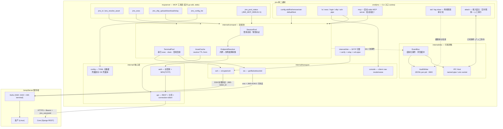
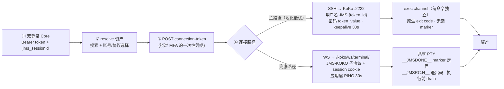
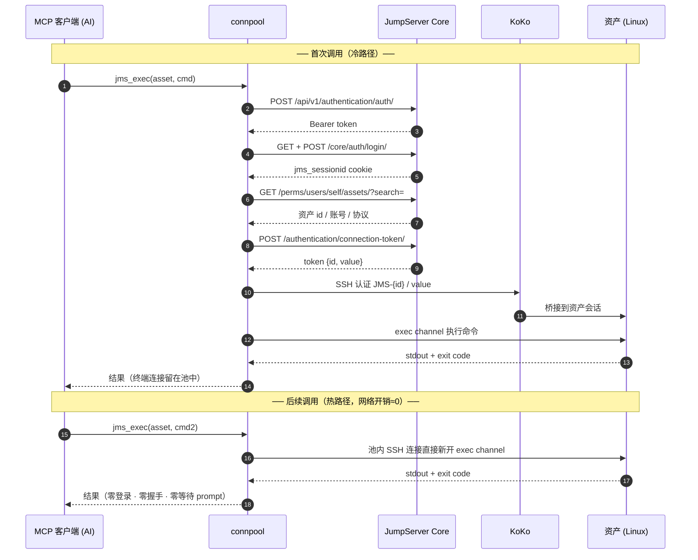
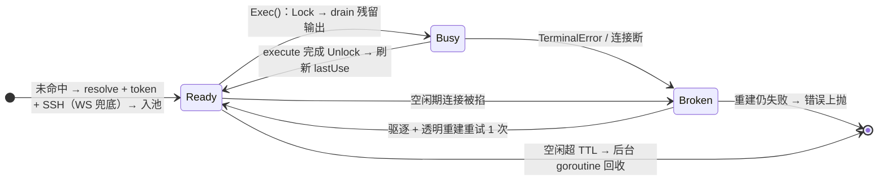
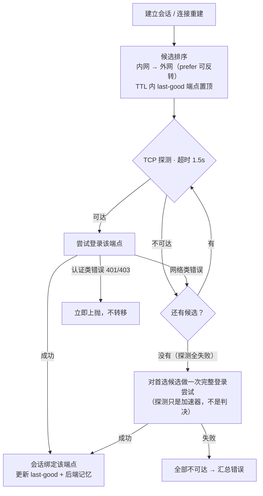
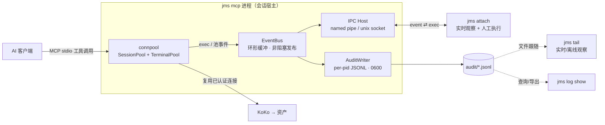

# jms-client 架构与设计

面向贡献者的技术设计文档：分层架构、连接池、KoKo 协议、端点故障转移与可观测性。使用与安装见 [README](README.md)。

---

## 1. 总体架构



分层规则：**CLI 与 MCP 只经过 pool/api 门面，永不直接摸 transport**。依赖方向单向向下。

### 包一览

| 包 | 职责 |
|---|---|
| `internal/config` | TOML 配置（仅元数据）；凭据读写 OS 凭据库与环境变量回退（§5） |
| `internal/api` | JumpServer REST 客户端：重试策略、分页、错误分类、connection-token |
| `internal/auth` | 双登录流程（Bearer + form cookie）、MFA/TOTP |
| `internal/assets` | 资产搜索与 resolve（账号/协议选择），TTL 缓存 |
| `internal/endpoint` | 双地址候选排序、TCP 探测、故障转移（§6） |
| `internal/connpool` | SessionPool / TerminalPool / AssetCache（§4） |
| `internal/transport` | SSH 与 WebSocket 两个 KoKo 终端后端、本地 console（§3） |
| `internal/xfer` | SFTP 引擎：分块、md5 校验、资产间中转、rsync 桥 |
| `internal/obs` | 事件总线、审计 JSONL、IPC 宿主（§7） |
| `internal/mcpserver` | stdio MCP 服务器，8 个工具接连接池 |
| `internal/cli` | cobra 命令面 |

## 2. KoKo 协议

以下是与 JumpServer 服务端交互的协议事实。修改相关代码前先读这一节——这些行为都经过真实服务端验证，很多与直觉不符。



### 2.1 认证

- KoKo WS/SSH 都认 **connection token**，token 绕过 MFA
- Token API：`POST /api/v1/authentication/connection-token/`，body `{asset, account(别名非显示名), protocol, connect_method}`
- SFTP 必须 `protocol=sftp, connect_method=web_sftp`；web_cli token 的 SFTP 子系统会落在 KoKo 虚拟根（报 "please select one of the assets"）

### 2.2 WebSocket 终端

- 端点 `/koko/ws/terminal/`（`/koko/ws/token/` 在部分版本 404）
- 握手必须带 form-login 的 `jms_sessionid` cookie；子协议 `JMS-KOKO`；URL 参数 `?disableautohash=false&token={id}&_={ts}`
- 输出是 **binary frame**；输入是 text-frame JSON `{"id": ws_id, "type": "TERMINAL_DATA", "data": "cmd\r"}`
- 初始化：收到 CONNECT 消息取 `id` → 回 `TERMINAL_INIT`，`data={"cols":200,"rows":50}`
- **心跳是应用层 text-frame PING**——Nginx 是透明 TCP 隧道，WS opcode 0x9 的 ping 根本到不了 KoKo；30s 间隔；服务端 PING 要回 PONG
- marker 协议：`__JMSDONE_{ms}__` 的最后两次出现之间是输出，`__JMSRC:N__` 是退出码。注意慢服务器可能在 PTY 就绪前后各回显一次命令行，marker 会出现三次以上——解析必须取最后两次（`parseMarkers`/`extractBetween`）
- 命令以 `#`、`\` 结尾或括号不闭合会吞掉 rc-capture 链导致挂起，超时是唯一防线
- **Gorilla/websocket 约束**：任何一次读失败（含 deadline 超时）都是永久错误，重读会触发 `repeated read on failed websocket connection` panic。读循环必须"首错即停"，取消靠关连接唤醒

### 2.3 SSH 后端

- KoKo SSH 端口 **2222**，用户名 `JMS-{token_id}`，密码 `token_value`
- 每条命令独立 exec channel，原生 exit code，无 marker 解析问题
- TCP connect timeout 15s（DROP 型防火墙会挂 75s）；握手额外限时 2s，保证 auto 回退不被拖死
- keepalive 30s

### 2.4 登录双流程

- Bearer token：`POST /api/v1/authentication/auth/`（MFA 先走 `/api/v1/authentication/mfa/challenge/` 再重试登录）
- `jms_sessionid` cookie：GET `/core/auth/login/` 拿 csrftoken → POST 表单（KoKo WS 只认这个 cookie，Bearer 不行）
- 字段名跨版本有差异：MFA 判定看 `code == "mfa_required"` **或** `error == "mfa_required"`

## 3. 连接池

三级资源：`ServerConfig`（静态）→ `AuthSession`（登录态）→ `Terminal`（SSH/WS 连接）。

### 3.1 SessionPool

- 按 `server alias` 缓存登录态；命中直接返回
- 401/cookie 失效 → 重新登录一次再重试当前操作（惰性验证，不做定时探活）
- 并发未命中共享同一次登录（singleflight）

### 3.2 TerminalPool

- 按 `server/asset/account/protocol` 复用终端——账号与协议在 connection token 里绑定，必须进 key
- **per-terminal 互斥**：共享 PTY/独立 channel 都不能并发执行，池持有每终端锁串行化；跨资产天然并行
- WS 后端执行前 drain 残留输出；marker 时间戳保证唯一
- 空闲回收：后台 goroutine 定期扫描 `lastUse`，超 TTL（默认 10min）关闭并出池；执行中的终端跳过，命令完成刷新 lastUse
- **重建不重放**：仅"命令尚未开始执行"（发送前失败）才驱逐重建并重试一次；已发出并收到部分输出的命令只上报错误——rm/reboot 这类非幂等命令的安全底线

### 3.3 数值基线

| 参数 | 值 | 依据 |
|---|---|---|
| WS 心跳间隔 | 30s | KoKo read timeout 5min / Nginx proxy 60s |
| SSH keepalive | 30s | — |
| 终端空闲 TTL | 10min | 保守默认 |
| resolve 缓存 TTL | 5min | 平衡资产改名感知 |
| HTTP 超时 | 15s | — |
| 重试 | 连接类错误 3 次，backoff 0.5/1/2s | — |
| 端点探测超时 | 1.5s | 防 DROP 型防火墙挂起（§6） |
| last-good 端点缓存 | 10min | 平衡切换灵敏度与探测开销 |

### 3.4 冷/热路径



终端池生命周期：



## 4. 交互式终端

本地 console（`internal/transport/console`）把终端置为 raw mode 并双向转发：

- Unix 用 termios（`x/term`）；Windows 用 console API（`x/sys/windows`），VT 输入 + `WriteConsoleW` 输出（绕过 GBK 代码页的乱码问题）
- stdin-only 判定交互性：`jms login > file` 不能静默禁用 raw mode
- 退出路径必须完整恢复 stdin 的 console mode——泄漏会让用户 shell 的方向键/回显失效
- 交互会话不进池（进程生命周期即会话生命周期）

## 5. 配置与凭据分层

**原则：配置文件里没有任何凭据。** 配置文件可能被备份、云盘同步、误提交，凭据一旦随之外泄后果严重。文件加密是伪安全（密钥可由同文件的 host+username 离线推导），正确做法是让文件里根本没有凭据。

| 数据 | 存放位置 | 敏感性 |
|---|---|---|
| 别名 / 内网地址 / 外网地址 / 用户名 / prefer / ssh_port | `config.toml`（明文） | 低：地址与用户名不构成登录凭据 |
| **password** | **OS 凭据库**（`go-keyring`） | 高 |
| **otp_secret** | **OS 凭据库** | 高 |

- 凭据库：Windows Credential Manager（DPAPI，静默）/ macOS Keychain / Linux Secret Service；service = `jms-client`，account = `<alias>/password` 与 `<alias>/otp_secret`
- **环境变量回退**：`JMS_PASSWORD_<ALIAS>` / `JMS_OTP_<ALIAS>`（大写别名），供 headless Linux / CI / WSL；优先级高于凭据库
- 两处都没有 → 明确报错并给出指引，**绝不静默降级为明文落盘**
- 文件可安全外泄/备份/进版本控制；权限仍收紧（Unix 0600 / Windows 当前用户 ACL），纵深防御；写入走原子替换
- 威胁模型边界：防住文件外泄与跨机器拷贝；防不住同用户账户下运行的恶意进程（所有 OS 凭据库方案的共同边界），以及环境变量回退在进程环境中的暴露面（可能进崩溃转储）
- MCP 客户端集成：MCP 条目 `{"command": "jms", "args": ["mcp"]}` 不含任何凭据，管理器可自由同步到所有 AI 客户端；凭据由 `jms config add` 一次性写入 OS 凭据库

## 6. 端点故障转移

一个别名可配置 `internal`（内网直连）与 `external`（外网映射）两个地址，至少填一个。默认内网优先、内网不通自动走外网，消灭"到公司改 default、出公司再改回来"的手工切换。



关键决策：

1. **绑定粒度是"会话"而非"单请求"**：端点选定后，REST 与 KoKo 连接全部由该地址派生，中途不跨端点混用；`jms_sessionid` cookie 天然按主机隔离，绑定语义与之一致
2. **故障转移只发生在建连阶段**：认证类错误（401/403）不转移——凭据问题换端点同样失败
3. **绝不自动重放已发出的命令**（§3.2 安全底线）
4. **后端记忆**：外网端点常只放行 WS（2222 被防火墙拦），记住每个端点上次成功的后端，冷连直接用它，避免每次先付 SSH 握手超时再退 WS
5. **探测是加速器不是判决**：TCP 只证明端口可达，VPN 半连（TCP 通、服务坏）靠登录阶段网络类失败继续转移兜底；探测全失败时对首选候选做一次完整登录尝试
6. **last-good 跨进程持久化**：小 JSON 文件（原子写入），CLI 一次性调用也免探测；10 分钟 TTL，失败即重新解析，最坏后果只是多一次探测
7. **人工覆盖**：`--endpoint internal|external`；审计事件带 `endpoint: internal|external`，`jms tail` 渲染徽标

## 7. 可观测性

MCP stdio 是 AI 客户端与 jms 之间的私有管道：AI 执行了什么命令、输出是什么、走的是冷连接还是池命中，用户只能从 AI 客户端 UI 里看——被折叠、被截断、headless 运行时干脆没有 UI。连接池进一步放大不可见性：连接活在 MCP server 进程里，用户没有"看见连接"的入口。

设计：宿主进程 + 事件总线 + 三条通道。



职责分离：

- **审计 JSONL**（离线，始终可用）：EventBus 的落盘订阅者，per-pid 文件
- **`jms tail`**（实时，文件驱动）：跟随审计目录，多进程合并；无宿主也能用
- **`jms attach`**（实时 + 交互，IPC 驱动）：接入宿主，观察事件流并可人工执行

### 7.1 审计日志

- 路径：`<config_dir>/audit/audit-YYYYMMDD-<pid>.jsonl`（文件与目录均 0600）
- per-pid 文件：规避 Windows 多进程追加同一文件的锁风险，多 MCP 实例并存安全
- 事件示例（每行一条 JSON）：

```json
{"ts":"2026-10-05T14:32:01.123+08:00","pid":12345,"actor":"mcp:pi","kind":"exec.end","server":"prod","asset":"web-01","backend":"ssh","endpoint":"external","command":"systemctl status nginx","exit_code":0,"duration_ms":118,"output_bytes":2140,"preview":"● nginx.service ...","pool":"hit","idle_ms":68000}
```

- kind 枚举：`exec.start` / `exec.end` / `pool.cold` / `pool.hit` / `pool.evict` / `pool.reap` / `session.login` / `session.relogin` / `endpoint.select` / `error`
- 输出预览默认截断 4KB（`JMS_AUDIT_PREVIEW_BYTES` 可调，`JMS_AUDIT_FULL=1` 落全量）
- 开关：`JMS_AUDIT=off` 关闭；`JMS_AUDIT_DIR` 换目录

### 7.2 IPC 宿主

- 传输：Windows 命名管道 `\\.\pipe\jms-<hash>`；Unix domain socket（0600）。仅本机可达、属主专属，绝不监听网络端口
- 协议：JSON-Lines；客户端 `hello{role:observer|operator, asset_filter?}` → 服务端推 `event`；operator 可发 `exec{command}` → 服务端经连接池执行 → 回 `exec.result`；`ping/pong` 保活
- 仲裁：人工命令与 AI 命令共用 TerminalPool 的 per-terminal 互斥——同一条连接上严格串行，执行中提示 busy；跨资产并行不互扰
- 宿主形态：嵌入 `jms mcp` 进程（覆盖核心场景：AI 在跑时才能观察）；多客户端并存时每个客户端一个独立宿主/池，审计日志 per-pid 按时间合并，`jms tail` 全局可见

## 8. 测试策略

1. **单元层**：auth 流程（httptest 模拟登录/MFA/cookie）、KoKo WS 帧编解码、marker 解析（含三重回显回归）、连接池状态机（命中/驱逐/重建/空闲回收，mock Terminal）
2. **协议回归**：把 KoKo 协议事实（§2）固化为测试断言（URL 形状、cookie 名、帧类型、marker 正则），防止重构时无意识破坏协议
3. **端点解析**：候选排序 / 探测超时 / 网络类 vs 认证类错误分流 / last-good 缓存 / 不重放约束（mock 端点注入故障）
4. **凭据分层**：mock keyring 读写/缺失/清理、环境变量优先级、凭据缺失时报错而非降级、配置文件原子写入
5. **接缝覆盖**：跨包接缝（如 CLI/MCP → xfer 的资产名传递）必须有断言，不能只靠两端各自的 mock 测试
6. **集成层**：`JMS_TEST_SERVER` 环境变量门控，连真实 JumpServer 跑 ls/exec/sftp；不设置则 skip（CI 无凭据时全绿）

教训：单元测试全绿不等于真实链路可用。marker 三重回显、WS 读超时即永久错误、Windows console 模式恢复等问题全部只在真实服务器上暴露过，协议回归测试是它们留下的护栏。

## 9. 技术栈

| 用途 | 库 |
|---|---|
| CLI | `spf13/cobra` |
| MCP | `modelcontextprotocol/go-sdk`（官方） |
| SSH | `golang.org/x/crypto/ssh` |
| SFTP | `github.com/pkg/sftp` |
| WebSocket | `github.com/gorilla/websocket` |
| TOTP | `github.com/pquerna/otp` |
| TOML | `github.com/BurntSushi/toml` |
| OS 凭据库 | `github.com/zalando/go-keyring` |
| TTY | `golang.org/x/term` + `golang.org/x/sys` |

不引入 orm / web 框架 / 依赖注入，保持零框架。
